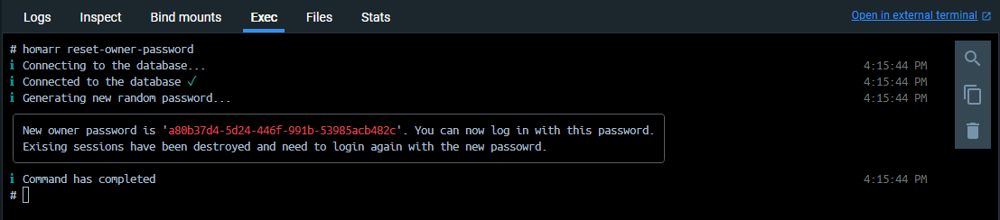

# 🔑 Password Recovery

:::info

This guide requires that you understand [how to access the CLI](../).

:::

This command can be useful, if you forget the password to your administrator account or you don't have access to the Web UI.

## Reset for the administrator

This command is parameter-less. It will create a random password, update the database and display the new password.
All sessions for the administrator will be terminated and they must re-login.

## Reset for a specific user

The syntax of the command is as follows:

Using the ``--username`` parameter, you can specify who you want to reset the password for.
Executing the command will create a new random password, update the database and display the new password.
All sessions for this user will be terminated and they must re-login.

