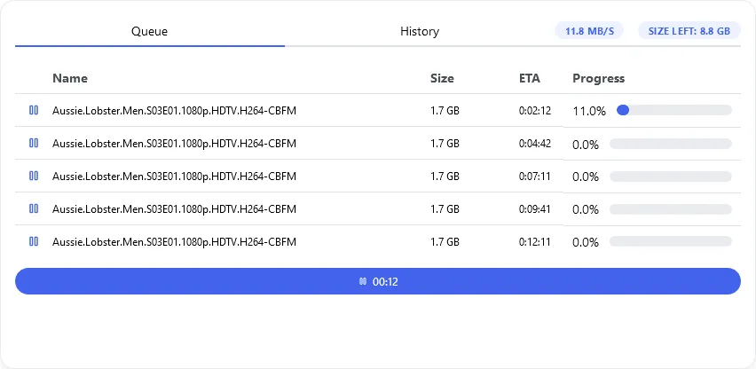
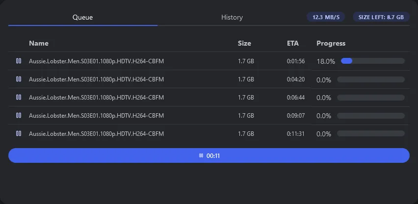

The Usenet widget uses [Integrations](/docs/management/integrations/) to display a list of usenets with their name, download/upload speed and progress.

---
## Adding the widget
Please check out our documentation on [how to add a widget](/docs/getting-started/after-the-installation#adding-widgets).

---

## Configuration
This widget does not offer any configurations. It will automatically use the configured [Usenet Client Integration](/docs/management/integrations/).
:::tip

Check out our documentation on [editing tiles](/docs/getting-started/after-the-installation#organizing-and-re-arranging-your-dashboard).

:::

---

## Screenshots

