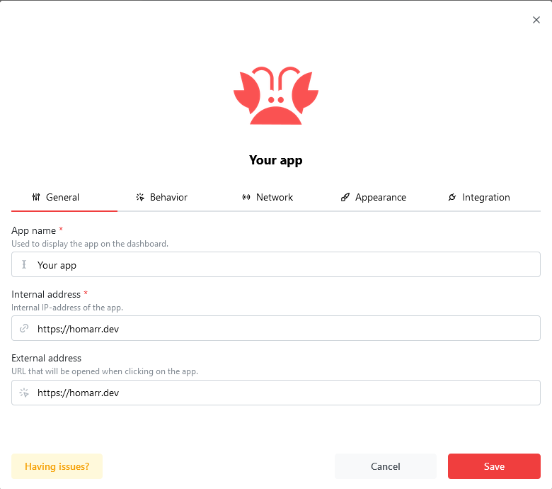
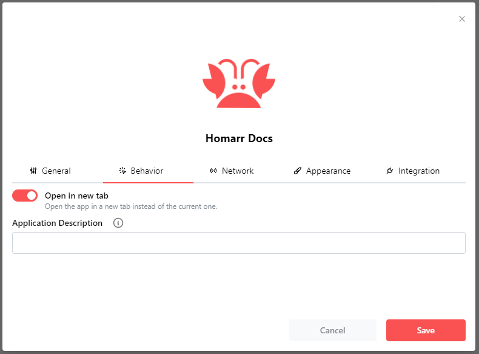
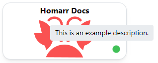
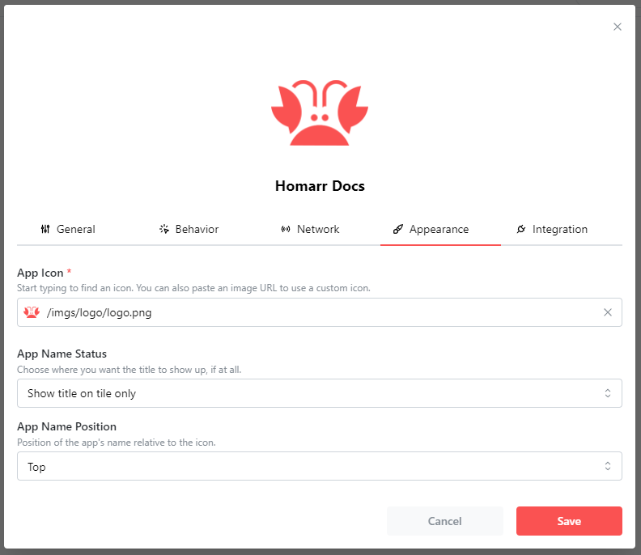
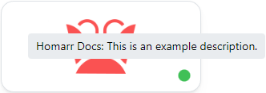
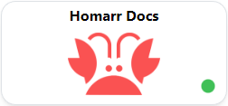
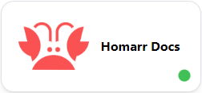
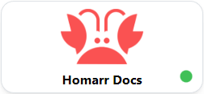
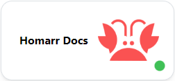

Apps are the main components of your board.
An app can be any application in your network or any public website on the Internet.
Each app currently must have a HTTP/S URL.
The behaviour, appearance and other factors of apps can be adjusted.

Please have a look at the [getting started guide](/docs/getting-started/after-the-installation#adding-your-first-app) on how to add an app.

## General

Here, you can configure:

- what name should be displayed on the tile
- the internal address *(see [glossary](/docs/getting-started/glossary))*
- the external address *(see [glossary](/docs/getting-started/glossary))*

In most scenarios, you should set the internal IP address to the LAN address (this means your local IPv4 address).
Homarr will use this IP to communicate with your app if needed.
The external address is only used, when the user clicks on the app.
Therefore, this should be something that is always reachable.
If you use a domain, (Cloudflare) tunnels or a reverse proxy, you should set this to their respective hostname.
Otherwise, you can use the same value as for internal address.



## Behavior

In the behaviour section, you can configure what should happen when you interact with the app.



### Open in new tab
By default, Homarr will open the app in a new tab when you click on it.
If you dislike this behavior, you can disable it here.

### Application Description
You can set a message/description to be shown when hovering your mouse over the app.



<br/>

## Network
As mention earlier, you can configure apps on your board to communicate.
This section configures whether you want to do this.

This feature is explained in greater detail here: [configuring pings on your board](/docs/advanced/customizations/board-customization.mdx#pings).

<br/>

## Appearance



### App Icon

This part is also explained later on in the documentation right here in [Icons.](https://homarr.dev/docs/customizations/icons#icon-search)

### App Name Status
Defines what element shows or doesn't show the title of the app
- Show Title on tile only : Show the title in the app tile present on the dashboard only. This is the default state.
- Show title on tooltip hover only : Shows the title in the same box as the description. Will be shown alone if no description is set. if selected, the title will not appear in the tile.
- Don't show at all : Don't show the title of the app anywhere.

 

### App Name Position
This option is only available on the ```Show Title on tile only``` option in the previous selector.
You can choose where the app's title will be on the tile relative to the Icon.

   

<br/>

## Integration

An app may have an integration. [Integrations](https://homarr.dev/docs/management/integrations/) are explained here.
