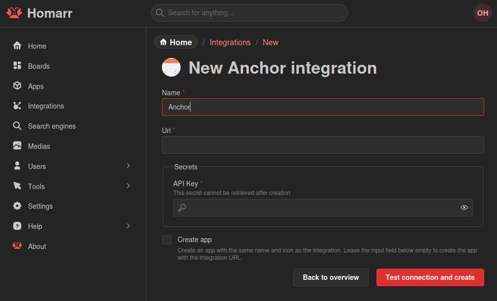
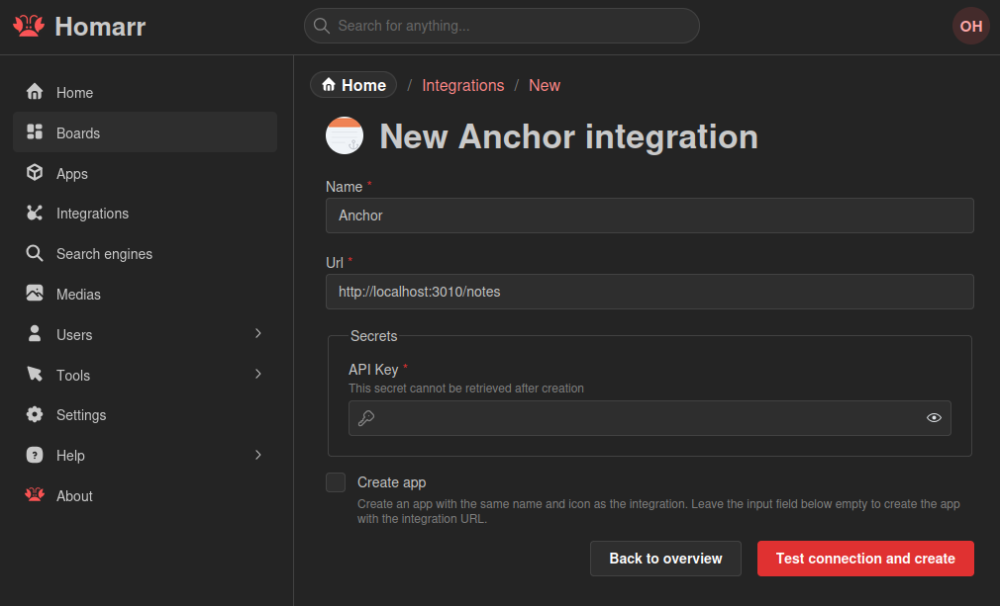
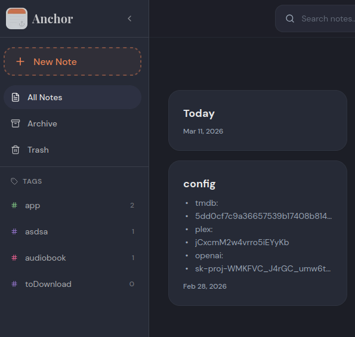

import { IntegrationHeader } from '@site/src/components/integrations/header';
import { IntegrationCapabilites } from '@site/src/components/integrations/widgets';
import { AddingIntegration } from '@site/src/components/integrations/adding';
import { IntegrationSecrets } from '@site/src/components/integrations/secrets';
import { IconNotes } from "@tabler/icons-react";
import { anchorIntegration } from '.';

<IntegrationHeader
  integration={anchorIntegration}
  categories={['Notes']}
/>

The Anchor integration lets Homarr connect to your Anchor instance so you can display and edit selected notes directly from your dashboard.

### Widgets & Capabilities
<IntegrationCapabilites
  items={[{
    capability: {
      icon: IconNotes,
      name: 'Anchor Note',
      description: 'Display and edit a selected Anchor note directly in Homarr.',
      path: '../../integrations/anchor#example-screenshots'
    }
  }]}
/>

### Adding the integration
<AddingIntegration />

Use the following example values when creating an Anchor integration:

- **Name:** Any display name (for example `Anchor`)
- **URL:** Base URL where Homarr can reach Anchor (for example `http://localhost:3010`)
- **Secrets -> API Key:** Your Anchor API key

### Secrets
<IntegrationSecrets secrets={[{
  credentials: ['apiKey'],
  steps: [
    'Open your Anchor instance.',
    'Generate or copy an API key from Anchor settings.',
    'Paste that key into the API Key secret field in Homarr.'
  ]
}]} />

### Example screenshots

