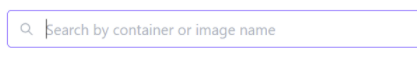

# 🐋 Containers
## Managing your Docker containers within Homarr

Homarr allows you to interact with Docker containers running on your system.

You can **restart**, **stop**, **start**, **refresh** and **remove** containers as well as **add** them to the Homarr dashboard

Additionally, if you have a lot of containers you can search and filter them by **container** or **image** name

View the state of each container (**created**, **running** or **stopped**)

And also check what ports the container has exposed (container port:external port)

### Before you begin
In order for Homarr to be able to interact with your Docker instance you must tell Homarr the path to your Docker socket.  You do this by adding the following to the Docker command when you first run Homarr:

`-v /var/run/docker.sock:/var/run/docker.sock`

If you are running Docker Desktop on Windows 10, use the following path to your Docker socket:

`-v //var/run/docker.sock:/var/run/docker.sock`