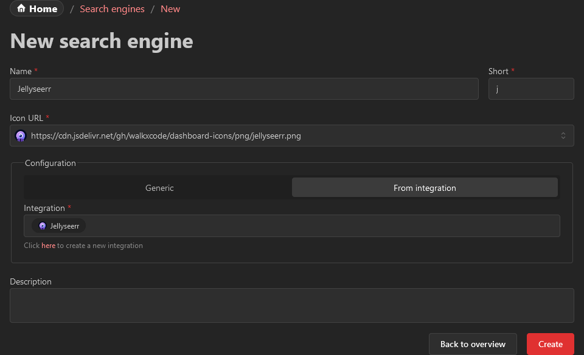
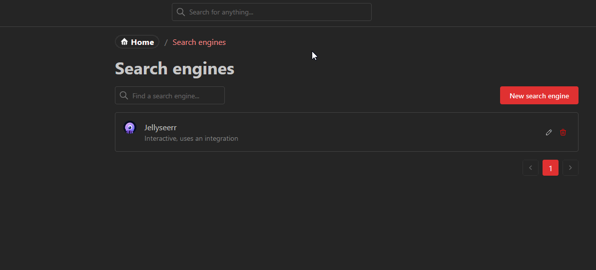

import Tabs from '@theme/Tabs';
import TabItem from '@theme/TabItem';

# Media requests
## Initial configuration
The [Overseerr](https://overseerr.dev/) / [Jellyseerr](https://github.com/Fallenbagel/jellyseerr) integration will enable you to request
movies and series directly from your Homarr dashboard.
Both integrations use [the search engine feature of Homarr](/docs/management/search-engines/) and require some additional configuration.

To start, create a new integration of the type `Overseerr` or `Jellyseerr``.
Next, create a new search engine and choose the option "From integration":

## Performing a search

After creation, you can search for shows or series in Jellyseerr / Overseerr by opening the search bar and performing a search in the search engine:

