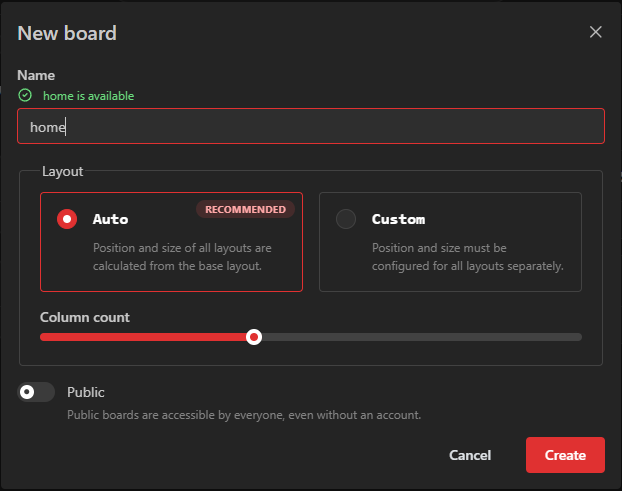

Each dashboard is called a "board".
You can create as many boards as you want.
Boards can be restricted to user groups.
A user may also have a "home board" which they will see at the root path (e.g. my-homarr.com or my-homarr.com/board).
Other boards can be viewed by direct links (e.g. my-homarr.com/board/smart-home) or via the management pages.

Names of boards must be unique because this will be used in the URL to load the desired board.

## Create a new board
When creating a board, the availability of the board name will be checked for you.

### Name
The name must not include any special characters and must be at least one character long.
Underscores and hyphen-minus are allowed.

### Column count
Homarr has a complex drag and drop system that can be used from the browser.
The column count defines how many horizontal columns are available to drag and drop elements to.

// TODO: create more detailed documentation on a separate page and link it here

### Public
This will enable public access for everyone - regardless of whether they are logged in or not.
This can be really useful if you want to have public boards in your company or for family and fiends.
Modifications for public boards must be allowed explicitly using user groups and their permissions.

## Board settings
You navigate to the board settings by clicking on these three dots:

Alternatively, you can also navigate from the board page itself using the cog icon at the top right:

### General
#### Page title
This is the title that will be visible at the top left in the navigation bar:

This field is optional and Homarr will fall back to "Homarr" if nothing is set.

#### Meta title
This is the secondary title of the page that is not directly visible in the page itself.
Browser will use it to set the title of tabs:

Homarr will fall back to the board name and a suffix if nothing is set.

#### Logo image URL
This is the URL that is used for the image at the top left.
Homarr will fall back to the Homarr logo if nothing is set.

#### Favicon image URL
This is the URL that is used for the favicon in the tab title.
Homarr will fall back to the Homarr logo if nothing is set.

### Layout
#### Column count
Homarr has a complex drag and drop system that can be used from the browser.
The column count defines how many horizontal columns are available to drag and drop elements to.

// TODO: create more detailed documentation on a separate page and link it here

### Background
#### Background image URL
Homarr can display a background image behind apps and widgets.
This URL can be used to define what image should be shown.

#### Background image attachment
This defines whether the background should move when the user scrolls.

#### Background image size
This defines whether the background should cover the entire page (and possibly be cropped) or never be cropped but may not cover the entire page.

#### Background image repeat
This defines whether the background should be repeated if it cannot cover the entire page.
This option can be useful if you have patterns that can be repeated easily (e.g. patterns):

### Colors
#### Primary color
Color that can be chosen freely to give accents to active elements.
#### Secondary color
Color that can be chosen freely to give accents.
#### Opacity
Opacity of the colors.

### Custom CSS
Using custom CSS, you can apply your own styling to Homarr.
See [board customizations](/docs/advanced/customizations/board-customizations) for more information.

### Access control

### Danger zone
#### Rename
Renaming a board will break all existing links to it permanently with no redirect.

#### Board visibility
By default, boards will be private. This means only authenticated users that are authorized have access.
Making a board public will expose it to everyone - including unauthenticated users.

#### Delete
This will permanently delete the board.
This action is irreversible and cannot be undone.

## Delete boards
## Setting boards as your home board
## Editing boards