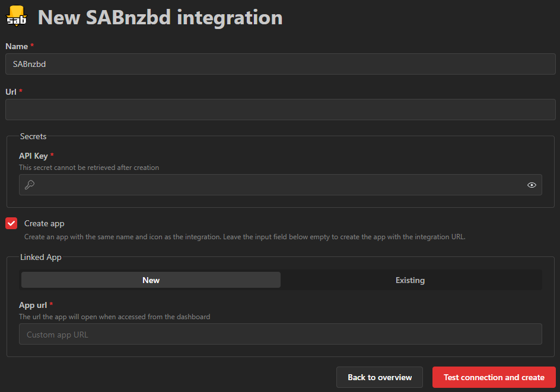

---
tags:
  - Integrations
  - Data sources
  - Connections
---

# Integrations
Integrations are connections to supported third party applications.
This page will describe the process of managing integrations but the process may vary depending on your specific integration.
Check [the available integrations](/docs/category/integrations) for further information.

## Create an integration
To create an integration, you can choose the supported application from the dropdown at the top right:

Next, you'll need to fill out the required fields to configure the integration:

### Name
Must be at least 1 character long, can be chosen freely.

### Url
This must be the base URL of the application where Homarr should connect to.
A few examples for this field include:
- sabnzbd.example.com
- example.com/sabnzbd

You must not append any path after the base URL. Some examples for incorrect usage:
- sabnzbd.example.com/settings
- example.com/sabnzbd/settings

### Secrets
An integration may or may not require secrets to function.
To process to obtain them is usually [documented in the integration pages](/docs/category/integrations).
Secrets are encrypted using a symmetric encryption and stored in the database.
To improve security, they will never be passed to the client and requests to the integrations are performed from the host where Hoamrr is running on.

### Testing and saving integration
It is not allowed to create an integration without passing the test.
This is to ensure that you minimize the amount of broken applications on your Homarr instance.
The test and create button will perform a network request to the application and authenticate if required.

## Troubleshooting connection
The connection to your integrations can fail due to many factors.
This is not an exhaustive list, and you will need to adjust some steps regarding on your setup.

1. Check whether you followed the Homarr documentation and didn't skip any steps.
This is the most often mistake that create many noisy support requests and following all steps will often resolve the problems.
2. Check Homarr's logs for more information. As we have no control over breaking changes in upstream APIs and third party software,
they can break without notice in unexpected ways which can also lead to errors within Homarr. In such case, these occurrences must be reported
and fixed within the source code of Homarr.
3. Check whether the host can reach the destination hostname / IP using ``ping`` and ``curl`` or ``wget`` afterward.
Execute this command on the host machine, not inside containers, to check whether it can connect or not.
4. Check whether the container / pod can reach the destination hostname / IP. Execute the same commands in the shell inside the container / pod.
5. Check your reverse proxy / authentication proxy logs for failures / hints
6. Check your security log of tunnels and VPNs
7. Check your router for security events
8. Check your VLAN configuration and firewall rules
9. Check your DNS settings for the host machine and the containers / pods and whether they can resolve the hostnames
10. Check throughput and stability of your network connection using ``iperf3``
11. Check syslog / drivers of your OS for hints
12. Check logs of your destination applications (eg. SABnzbd)
13. Attempt to disable CSRF / tamper protections when absolutely no other workaround available -> this comes with some security implications - be careful!
Re-enable if this didn't fix the issue.

If none of these troubleshooting steps worked, you can request support from our team in Discord or GitHub.