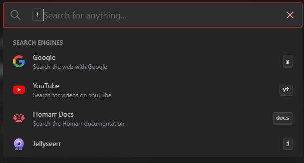
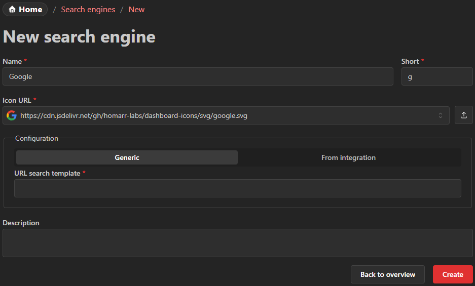

---
tags:
  - Search engines
  - Google
  - Search
---

# Search Engines
Using the search engines, terms can be quickly searched simply by opening the search bar at the top.

It will also work with any sites that search through content (e.g. Netflix, torrent indexers, ...).
It is required that the site has the search term somewhere in the URL.

## Create search engine
To create a custom search engine, you can click the button at the top of the page.

### Name
The name can be chosen freely. It will be displayed in the search box popover.

### Short
Prefix that is used to choose the search engine in the popover using the keyboard.
It is recommended that this value is kept short (for example ``g`` for Google and ``e`` for Ecosia).

### Search template
The template must be a valid URL that incldues the ``%s`` placeholder.
Example for Google: ``https://www.google.com/search?q=%s``
Homarr will replace the ``%s`` with the term that the user entered.
