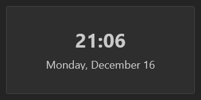

The Clock widget will display the current time and date. The widget will use your current system time.

## Adding the widget
Please check out our documentation on [how to add a widget](/docs/getting-started/after-the-installation#embed-integration-data-using-widgets).

## Configuration

| Configuration        | Description                                                                                                                    | Values                                                                                                                                                            | Default Value       |
| -------------------- | ------------------------------------------------------------------------------------------------------------------------------ | ----------------------------------------------------------------------------------------------------------------------------------------------------------------- | ------------------- |
| City Title           | Choose if you want to add a title above the time to show the city you selected and the timezone code it is in.                 | <ul><li>City and Timezone</li><li>City only</li><li>None</li></ul>                                                                                                | City and Timezone   |
| 24 hour format       | Determines if the clock displays in 12 or 24 hour format                                                                       | yes / no                                                                                                                                                          | yes                  |
| Display seconds      | Display seconds in the time                                                                                                    | yes / no                                                                                                                                                          | no                  |
| Use a fixed timezone | In case you want to show a timezone different from where you currently are. When enabled, you must choose from a timezone list | yes / no                                                                                                                                                          | no                  |
| Show the date        | Whether the date (day, month, year) should be displayed                                                                        | yes / no                                                                                                                                                          | yes                 |
| Date format          | How the date should look like                                                                                                  | <ul><li>Monday, December 16</li><li>Monday, 16 December</li><li>Dec 16</li><li>16 Dec</li><li>16/12/2024</li><li>12/16/2024</li><li>16/12</li><li>12/16</li></ul> | Monday, December 16 |
