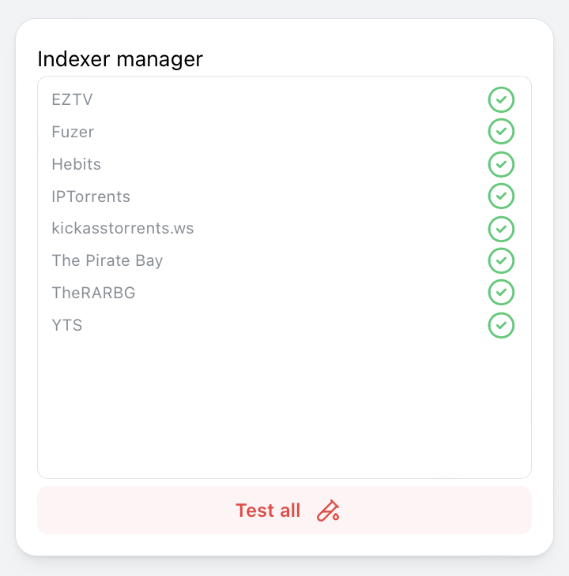
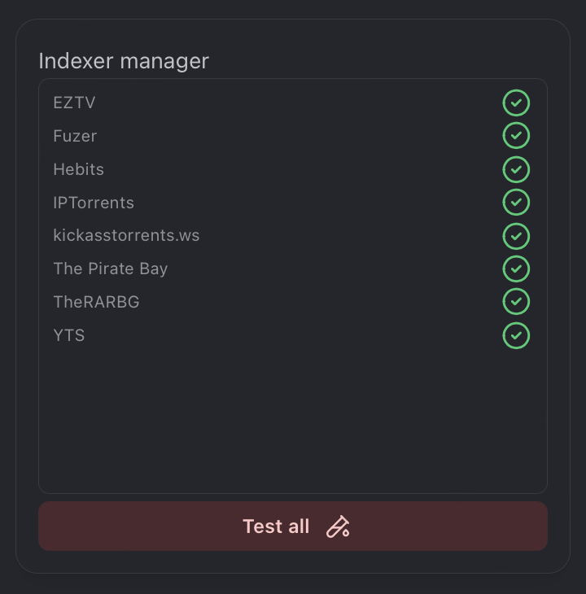

The Indexer Manager widget uses [Integrations](/docs/category/integrations) to display Indexers status with their name.

---
## Adding the widget
Please check out our documentation on [how to add a widget](/docs/getting-started/after-the-installation#adding-widgets).

---

## Screenshots

