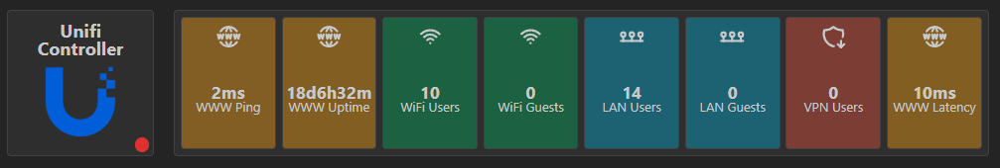

If you're running a Unifi Controller instance, you might want to display statistics on your dashboard.
This widget enables you to integrate crucial data on your dashboard in Homarr.

## Adding the widget
Please check out our documentation on [how to add a widget](/docs/getting-started/after-the-installation#embed-integration-data-using-widgets).

## Configuration

### Network Controller Summary widget

| Configuration          | Description                                                                    | Values                                                     | Default Value |
| ---------------------- | ------------------------------------------------------------------------------ | ---------------------------------------------------------- | ------------- |
| Layout                 | Choose the layout in which the informations are displayed.                     | <ul><li>Grid</li><li>Horizontal</li><li>Vertical</li></ul> | Horizontal    |
| Widget Content         | Select the widget blocks that are displayed. The order of selection is the order of visibility from left to right or top to bottom depending on the selected layout. | <ul><li>WWW Ping</li><li>WWW Latency</li><li>WWW Uptime</li><li>WiFi Users</li><li>WiFi Guests</li><li>LAN Users</li><li>LAN Guests</li><li>VPN Users</li></ul> | Wifi Users |
