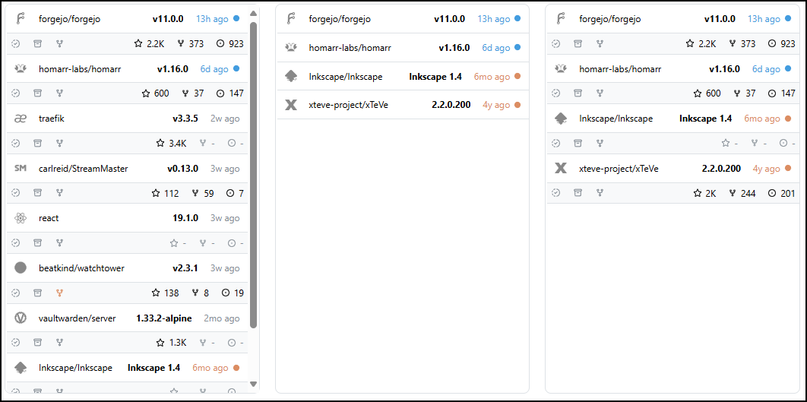
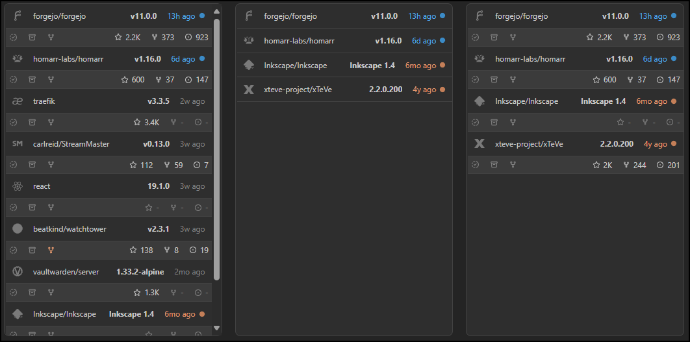
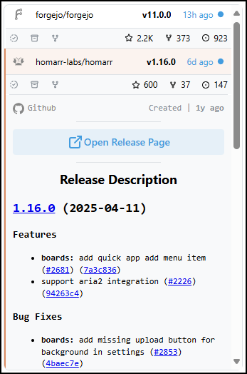
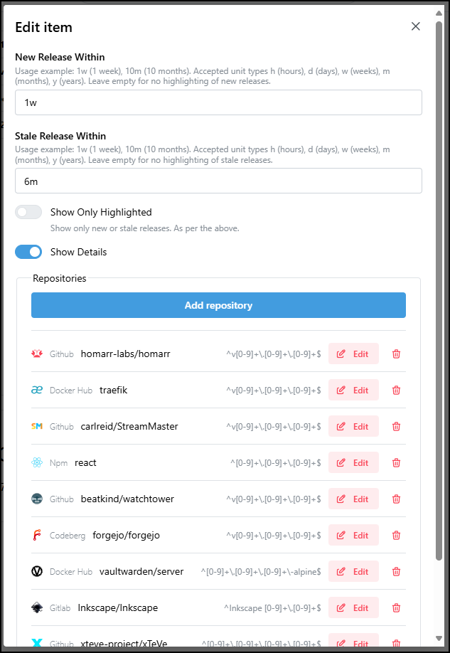
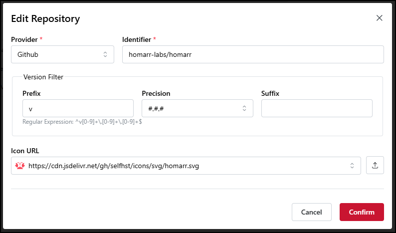

The releases widget enables you to track a list of repositories and see their respective latest release. 

## Adding the widget
Please check out our documentation on [how to add a widget](/docs/getting-started/after-the-installation#embed-integration-data-using-widgets).

## Configuration
See [screeshot](#options) for the configuration options.

| Configuration         | Description                                                                                          | Values                                                                                                             | Default Value |
| --------------------- | ---------------------------------------------------------------------------------------------------- | ------------------------------------------------------------------------------------------------------------------ | ------------- | 
| New Release Within    | Define when a release should be highlighted as new. Can be left empty for no highlighting.           | <ul><li>#h (# hours)</li><li>#d (# days)</li><li>#w (# weeks)</li><li>#m (# months)</li><li>#y (# years)</li></ul> | 1w            |
| Stale Release Within  | Define when a release should be highlighted as stale. Can be left empty for no highlighting.         | <ul><li>#h (# hours)</li><li>#d (# days)</li><li>#w (# weeks)</li><li>#m (# months)</li><li>#y (# years)</li></ul> | 6m            | 
| Show Only Highlighted | If switched, only the highlighted releases will be shown. Releases with errors will always be shown. | yes / no                                                                                                           | yes           |
| Show Details          | If switched, shows a secondary row with additional information about the repository.                 | yes / no                                                                                                           | yes           |
| Repositories          | The list of repositories to track.                                                                   | See [**Configuration per repository**](#configuration-per-repository)                                              | -             |

### Configuration per repository
See [screeshot](#options---repository-edit) for the configuration options.

| Configuration   | Description                                                                                                         | Values                                                                        | Default Value |
| --------------- | ------------------------------------------------------------------------------------------------------------------- | ------------------------------------------------------------------------------| ------------- |
| Provider        | The repository provider.                                                                                            | Choice                                                                        | Docker Hub    |
| Identifier      | The repository identifier.                                                                                          | String                                                                        | Empty         |
| Version Filter  | A filter to define what format of realease tag the system should track. Can be left empty to track the latest tag.  | See [**Configuration for version filter**](#configuration-for-version-filter) | -             |
| Icon URL        | The URL of the icon to display.                                                                                     | URL                                                                           | Empty         |

### Configuration for version filter

| Configuration | Description                      | Values                                                                                                 | Default Value |
| ------------- | -------------------------------- | ------------------------------------------------------------------------------------------------------ | --------------|
| Prefix        | A prefix for the version filter. | String                                                                                                 | Empty         |
| Precision     | The version precision.           | <ol start="0"><li>None</li><li>#</li><li>#.#</li><li>#.#.#</li><li>#.#.#.#</li><li>#.#.#.#.#</li></ol> | None          |
| Suffix        | A suffix for the version filter. | String                                                                                                 | Empty         |

:::note

The version filter is used to match the version tag of the release. It is a combination of the prefix, precision and suffix.

Setting the Prefix to `v`, precision to `2` and the Suffix to `-alpha`, will match `v1.0-alpha` but not `v1.0-beta`.  
Setting the Prefix to `v`, precision to `3`, will match `v5.2.0` but not `v1.0.2-alpha` or `Beta v5.2.1`.

:::

:::tip

Check out our documentation on [editing tiles](/docs/getting-started/after-the-installation#arrange-and-organize-your-board).

:::

## Layouts
| Image  | Show Only Highlighted | Show Details |
| ------ | --------------------- | ------------ |
| Left   | no                    | yes          |
| Middle | yes                   | no           |
| Right  | yes                   | yes          |

## Expanded view
Clicking on a repository will open the expanded view. This view shows additional information about the repository and the latest release.
This will show the release notes if available.

## Screenshots
#### Options

#### Options - Repository Edit
