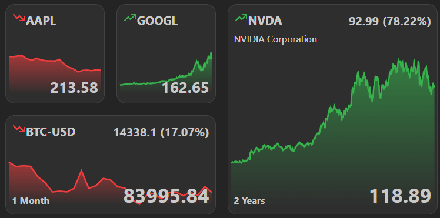

Using the Stocks widget, you can show the current stock prices of your favorite companies on your dashboard.

## Adding the widget
Please check out our documentation on [how to add a widget](/docs/getting-started/after-the-installation#embed-integration-data-using-widgets).

## Example stocks

Here's a small collection of examples, that you can use for testing or actual use (in no particular order):
- AAPL
- GOOGL
- AMZN
- TSLA
- MSFT
- META
- NVDA
- NFLX
- BTC-USD
- ETH-USD

## Configuration

| Configuration         | Description | Values | Default Value |
| --------------------- | ----------- | ------ | ------------- |
| Stock symbol | The stock symbol of the company. | String | AAPL |
| Time range | The time range of the stock price. | `1d`, `5d`, `1mo`, `3mo`, `6mo`, `1y`, `2y`, `5y`, `10y`, `ytd`, `max` | `1mo` |
| Time interval | The interval between the stock prices. | `5m`, `15m`, `30m`, `1h`, `1d`, `5d`, `1wk`, `1mo` | `1d` |