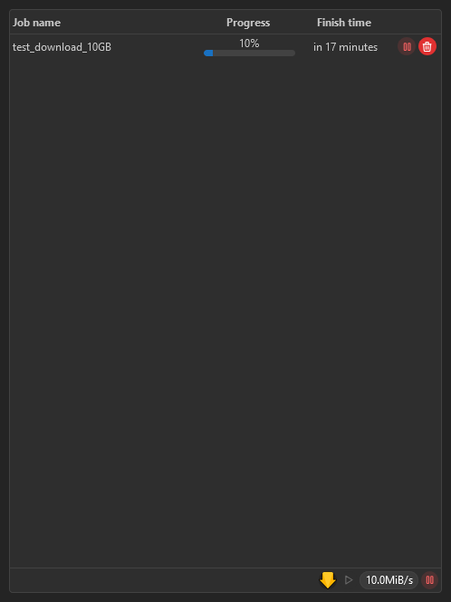
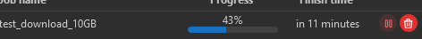
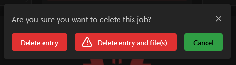
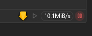

The download widget uses [Integrations](/docs/category/integrations) to display a list of torrents or Usenet articles with their name, download/upload speed and progress.

## Adding the widget
Please check out our documentation on [how to add a widget](/docs/getting-started/after-the-installation#embed-integration-data-using-widgets).

## Controls
You can control the downloads directly from the widget.
For example, you can pause or delete a download:

If you delete a job you will be asked for confirmation:

At the bottom of the widget, you can also see the download speed over all your download clients:

## Configuration

| Configuration                           | Description                          | Values                                                                                               | Default Value                                                                                        |
| --------------------------------------- | ------------------------------------ | ---------------------------------------------------------------------------------------------------- | ---------------------------------------------------------------------------------------------------- |
| Columns to show                         | Defines what columns should be shown | <ul><li>Integration</li><li>Job name</li><li>Progress</li><li>Finish time</li><li>Controls</li></ul> | <ul><li>Integration</li><li>Job name</li><li>Progress</li><li>Finish time</li><li>Controls</li></ul> |
| Enable items sorting                    | Enables the sorting in the table     | yes / no                                                                                             | no                                                                                                   |
| Show usenet entries marked as completed | Also show completed usenet downloads | yes / no                                                                                             | yes                                                                                                  |
| Categories / labels to filter           | Filter the categories and labels     | list                                                                                                 | empty list                                                                                           |
| Filter as a whitelist                   | Invert the above filter              | yes / no                                                                                             | no                                                                                                   |

:::tip

Check out our documentation on [editing tiles](/docs/getting-started/after-the-installation#arrange-and-organize-your-board).

:::
