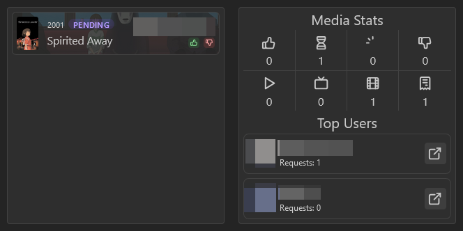

The media requests widget enables you to integrate with [Overseerr and Jellyseerr](/docs/integrations/media-requester).
Using the widget, you can view the current media requests.

There are two widgets that you can use:
- **Request list**: Provides a list of all open and recently closed requests. It also provides the functionality to approve or reject requests
- **Request stats**: Provide a statistics overview of your media requests, such as mount of requests, open requests, approvement and rejections.

## Adding the widget
Please check out our documentation on [how to add a widget](/docs/getting-started/after-the-installation#embed-integration-data-using-widgets).

## Configuration
Both media requests widget have the same configurations.

| Configuration         | Description                                                      | Values   | Default Value |
| --------------------- | ---------------------------------------------------------------- | -------- | ------------- |
| Open links in new tab | Every link will open in a new tab instead if in the current tab. | yes / no | yes           |
