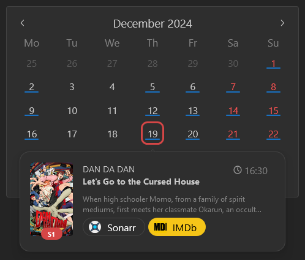

The calendar Widget will use [Integrations](/docs/category/integrations) to display upcoming content.
It can display content from [Sonarr](/docs/1.18.0/integrations/servarr#sonarr),
[Radarr](/docs/1.18.0/integrations/servarr#radarr),
[Lidarr](/docs/1.18.0/integrations/servarr#lidarr) and
[Readarr](/docs/1.18.0/integrations/servarr#readarr).

## Adding the widget
Please check out our documentation on [how to add a widget](/docs/getting-started/after-the-installation#embed-integration-data-using-widgets).

## Using the widget
The calendar widget will display a calendar with indicators for upcoming releases:

### Colors of indicators and their meaning
All indicators in the calendar have a specific color depending on their app:

| Color          | Integration | Project link                                 |
| -------------- | ----------- | -------------------------------------------- |
| 🔴 *(red)*    | Readarr     | [Readarr project link](https://readarr.com/) |
| 🟡 *(yellow)* | Radarr      | [Radarr project link](https://radarr.video/) |
| 🟢 *(green)*  | Lidarr      | [Lidarr project link](https://lidarr.audio/) |
| 🔵 *(blue)*   | Sonarr      | [Sonarr project link](https://sonarr.tv/)    |

#### Release Poster
Homarr will load the images from your integration, for example Sonarr.
It will choose the image with the highest quality automatically.

## Configuration

| Configuration       | Description                                                                                  | Values                                                     | Default Value |
| ------------------- | -------------------------------------------------------------------------------------------- | ---------------------------------------------------------- | ------------- |
| Radarr release type | Select what type of release date to see.                                                     | <ul><li>Cinemas</li><li>Physical</li><li>Digital</li></ul> | In Cinemas    |
| Start from          | Amount of months in past that Homarr should load in background. Higher number means more memory usage.   | 2-9999                                                     | 2             |
| End at              | Amount of months in future that Homarr should load in background. Higher number means more memory usage. | 2-9999                                                     | 2             |
