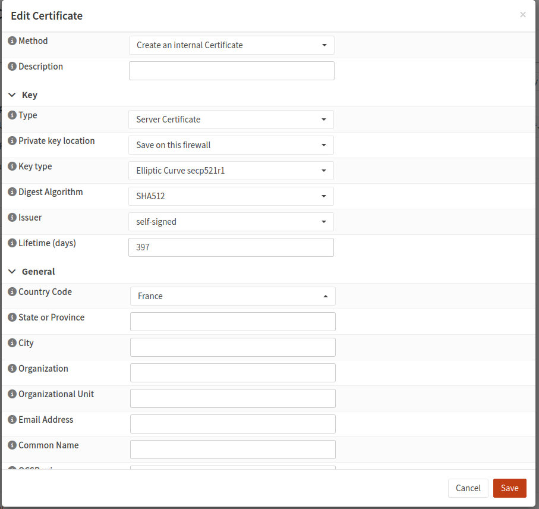
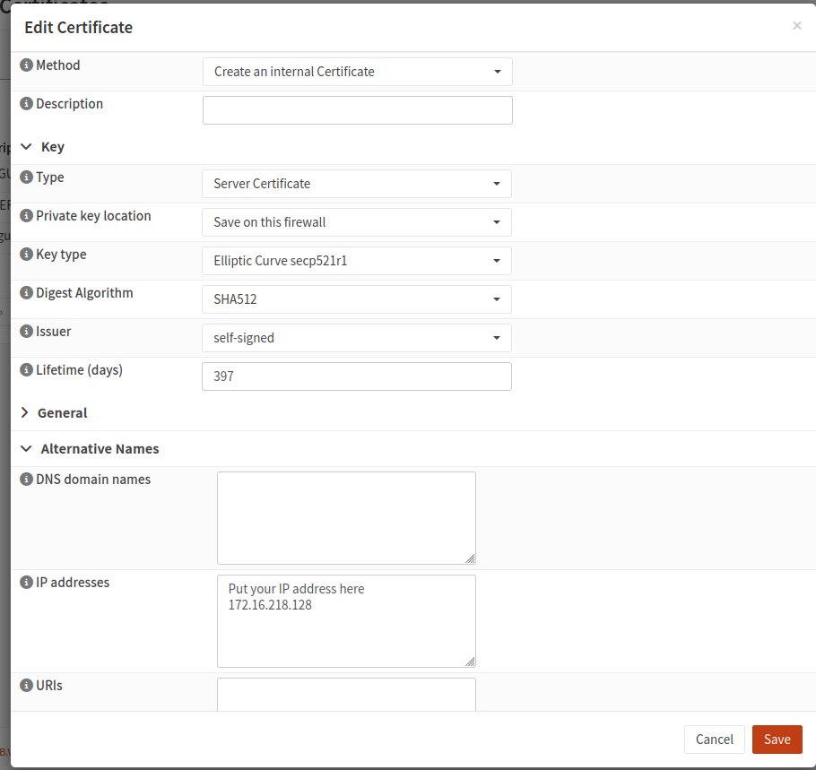
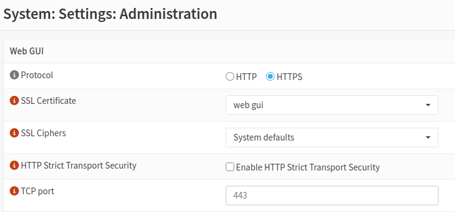

import { IntegrationHeader } from '@site/src/components/integrations/header';
import { IntegrationCapabilites } from '@site/src/components/integrations/widgets';
import { AddingIntegration } from '@site/src/components/integrations/adding';
import {IntegrationSecrets} from '@site/src/components/integrations/secrets';
import { IconHeartRateMonitor } from "@tabler/icons-react";
import { opnsenseIntegration } from '.';
import Alert from '@theme/Admonition'
import { firewallWidget } from '../../widgets/firewall';

<IntegrationHeader
  integration={opnsenseIntegration}
  categories={['Firewall']}
/>

### Widgets & Capabilities
<IntegrationCapabilites
    items={[{
        widget: firewallWidget,
    }]}
/>

### Adding the integration
<AddingIntegration />

#### Using HTTPS to access your firewall

If you are using HTTPS to access your firewall, you must add the certificate to Homarr before adding the integration

Moreover, if you are accessing your firewall through its IP address, you also need to generate a custom certificate that includes the IP address you access it with.

go to System -> Trust -> Certificates in the dashboard.

Create a new certificate

Method : Create an internal certificate

Description : what ever you like, but something meaningful

Type : Server Certificate

Private Key Location : Save on this firewall

Key type : RSA 4096

Digest Algorithm : SHA 512

Country code : Your Country

DNS domain names : any DNS name you are using to access your OPNsense firewall

IP addresses : the IP address you access your firewall with

When everything seems good, click save to generate the certificate

Now head out to System -> Settings -> Administration

Click on the select box next to Certificates and select the previously created certificate

When you save this parameter, you'll probably have to refresh the web page to redeem access to your firewall.

### Secrets
<IntegrationSecrets secrets={[{
    tabLabel: "ApiKey (Key & Secret)",
    credentials: ['opnsenseApiKey', 'opnsenseApiSecret'],
    steps: [],
}]} />
